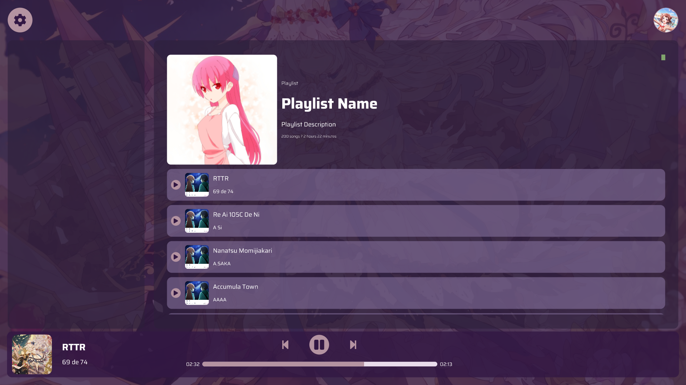

# Yuzaki

A simple music player that use a local beatmap data from osu! to play music.

## Project Status

This project is my personal project that I make it when I have free time. But the basic function that 'music player' need is prioritized.

Now you can use this but some function that music player need is not implemented yet.

## Contributing

If you have any idea or found any issue, feel free to open an issue or a pull request!

## License

This project is licensed under the MIT License - see the [LICENSE](LICENSE) file for details.  tl;dr you can do whatever you want as long as you include the original copyright and license notice in any copy of the software/source

We are not affiliated with osu! or ppy Pty Ltd.